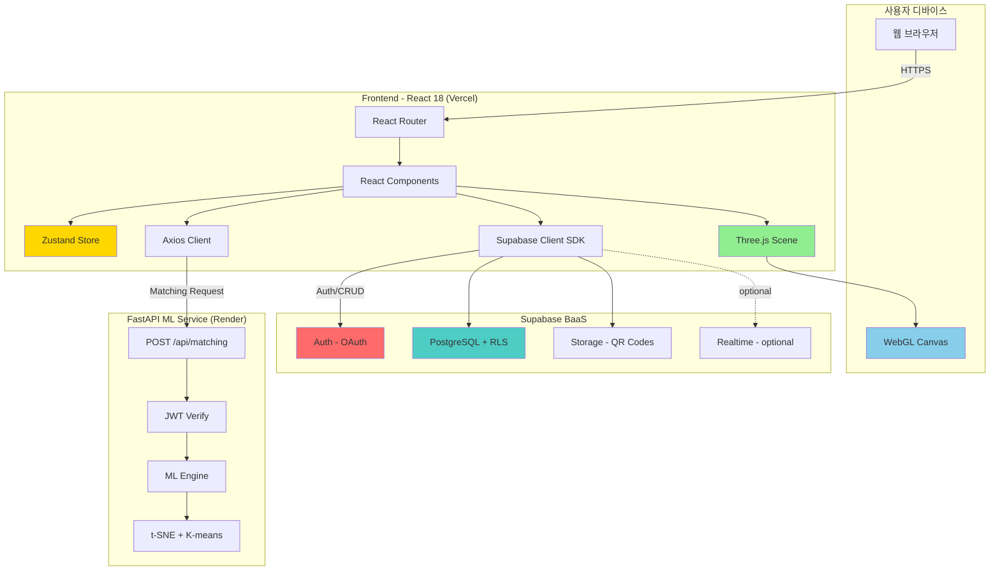
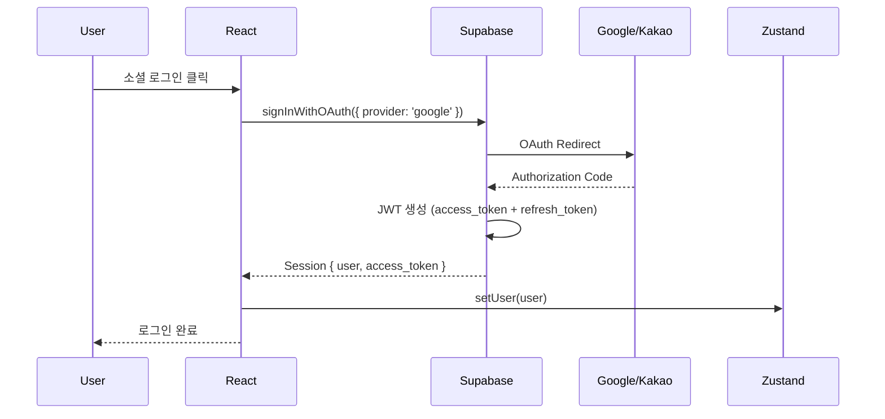
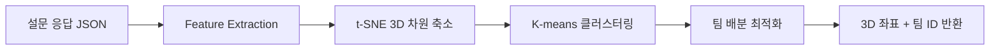
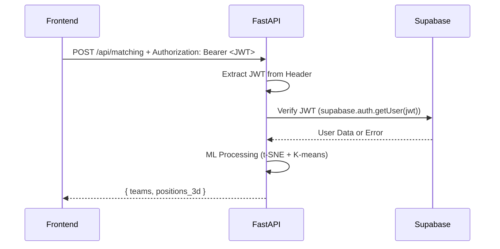
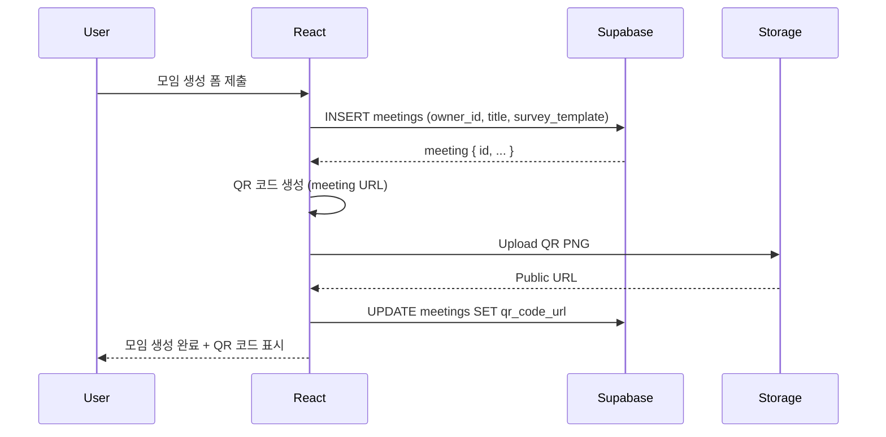
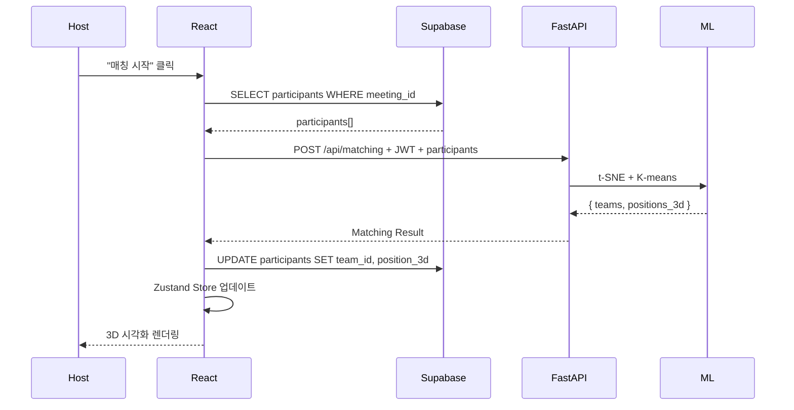

# TeamBlend 아키텍처

> **최종 수정**: 2026-01-02
> **작성자**: Claude Code
> **관련 문서**: [TeamBlend_PRD.md](./TeamBlend_PRD.md), [02_FOLDER_STRUCTURE.md](./02_FOLDER_STRUCTURE.md)

---

## 목차

1. [아키텍처 개요](#아키텍처-개요)
2. [핵심 설계 원칙](#핵심-설계-원칙)
3. [Supabase 통합 아키텍처](#supabase-통합-아키텍처)
4. [FastAPI ML 서비스 아키텍처](#fastapi-ml-서비스-아키텍처)
5. [Three.js 3D 시각화 아키텍처](#threejs-3d-시각화-아키텍처)
6. [인증 시스템 (Supabase Auth + JWT)](#인증-시스템-supabase-auth--jwt)
7. [상태 관리 전략 (Zustand + Supabase)](#상태-관리-전략-zustand--supabase)
8. [데이터 흐름 패턴](#데이터-흐름-패턴)
9. [에러 처리 시스템](#에러-처리-시스템)
10. [빌드 및 배포](#빌드-및-배포)

---

## 아키텍처 개요

### 하이브리드 BaaS + ML 마이크로서비스 구조

TeamBlend는 **Supabase (Backend-as-a-Service)**를 기본 인프라로 사용하고, **FastAPI 기반 ML 마이크로서비스**를 매칭 알고리즘 전용으로 운영하는 하이브리드 아키텍처입니다.

**아키텍처 선택 이유**:
- **Supabase 장점**: 인증/DB/스토리지 통합, PostgreSQL + RLS 보안, 실시간 기능
- **FastAPI 필요성**: Python 기반 scikit-learn (K-means, t-SNE) ML 처리 필수
- **분리 원칙**: 인프라 관리(Supabase) vs ML 로직(FastAPI) 명확한 책임 분리

### 시스템 구성도



### 프로젝트 물리적 분리

```
workspace/
├── React_Project/teamblend/          # Frontend (React + Supabase)
│   ├── src/
│   │   ├── lib/supabase.ts           # Supabase 클라이언트 초기화
│   │   ├── api/mlService.ts          # FastAPI ML 서버 호출
│   │   └── components/
│   └── .env                          # VITE_SUPABASE_URL, VITE_SUPABASE_ANON_KEY
│
└── Python_Project/teamblend-ml/      # ML Service (FastAPI)
    ├── app/
    │   ├── main.py                   # FastAPI 진입점
    │   ├── core/supabase_verify.py   # Supabase JWT 검증
    │   └── ml/                       # ML 알고리즘
    └── .env                          # SUPABASE_URL, SUPABASE_SERVICE_ROLE_KEY
```

---

## 핵심 설계 원칙

### 1. Backend-as-a-Service 우선 (Supabase First)
- **인증/DB/스토리지는 Supabase**: 서버 코드 없이 SDK로 처리
- **ML만 FastAPI**: scikit-learn 필요한 알고리즘만 분리
- **PostgreSQL + RLS**: Row Level Security로 데이터 접근 제어
- **Edge Functions 회피**: TypeScript로 t-SNE 구현 비효율적

### 2. 선언적 3D 프로그래밍 (Three.js)
- **React Three Fiber**: Three.js를 React 컴포넌트처럼 선언적으로 작성
- **JSX 기반 Scene 구성**: `<mesh>`, `<sphereGeometry>`, `<meshStandardMaterial>`
- **React Hooks 통합**: `useFrame`, `useThree`, `useLoader`

### 3. 타입 안전성 (TypeScript)
- **Supabase Type Generation**: `supabase gen types typescript` → database.types.ts
- **Zod 스키마**: ML 요청/응답 런타임 검증
- **Strict Mode**: `tsconfig.json`에서 strict: true

### 4. 보안 우선 설계
- **Supabase RLS**: 사용자별 데이터 격리 (SQL 정책)
- **JWT 검증**: FastAPI에서 Supabase 발급 토큰 검증
- **환경 변수 분리**: .env 파일 git ignore, 프로덕션은 플랫폼 시크릿

---

## Supabase 통합 아키텍처

### 1. 인증 시스템 (Supabase Auth)

#### OAuth 플로우


#### 구현 예시

**src/lib/supabase.ts**:
```typescript
import { createClient } from '@supabase/supabase-js';
import type { Database } from '@/types/database.types';

const supabaseUrl = import.meta.env.VITE_SUPABASE_URL;
const supabaseAnonKey = import.meta.env.VITE_SUPABASE_ANON_KEY;

export const supabase = createClient<Database>(supabaseUrl, supabaseAnonKey);
```

**src/hooks/useAuth.ts**:
```typescript
import { useEffect } from 'react';
import { supabase } from '@/lib/supabase';
import { useAuthStore } from '@/store/authStore';

export function useAuth() {
  const { user, setUser, clearUser } = useAuthStore();

  useEffect(() => {
    // 세션 초기화
    supabase.auth.getSession().then(({ data: { session } }) => {
      setUser(session?.user ?? null);
    });

    // 세션 변경 감지
    const { data: { subscription } } = supabase.auth.onAuthStateChange((_event, session) => {
      setUser(session?.user ?? null);
    });

    return () => subscription.unsubscribe();
  }, []);

  const signInWithGoogle = () => supabase.auth.signInWithOAuth({ provider: 'google' });
  const signInWithKakao = () => supabase.auth.signInWithOAuth({ provider: 'kakao' });
  const signOut = () => supabase.auth.signOut().then(clearUser);

  return { user, signInWithGoogle, signInWithKakao, signOut };
}
```

### 2. 데이터베이스 (PostgreSQL + RLS)

#### 스키마 설계

```sql
-- meetings 테이블
CREATE TABLE meetings (
  id UUID PRIMARY KEY DEFAULT gen_random_uuid(),
  created_at TIMESTAMPTZ DEFAULT now(),
  owner_id UUID REFERENCES auth.users(id) ON DELETE CASCADE,
  title TEXT NOT NULL,
  description TEXT,
  survey_template JSONB NOT NULL,  -- 질문 템플릿
  status TEXT DEFAULT 'active',    -- active, completed, archived
  qr_code_url TEXT,                -- Supabase Storage URL
  max_participants INT DEFAULT 100
);

-- participants 테이블
CREATE TABLE participants (
  id UUID PRIMARY KEY DEFAULT gen_random_uuid(),
  created_at TIMESTAMPTZ DEFAULT now(),
  meeting_id UUID REFERENCES meetings(id) ON DELETE CASCADE,
  name TEXT NOT NULL,
  survey_response JSONB NOT NULL,  -- 설문 응답 데이터
  team_id INT,                     -- ML 매칭 결과
  position_3d JSONB                -- { x, y, z } 3D 좌표
);

-- Row Level Security (RLS) 정책
ALTER TABLE meetings ENABLE ROW LEVEL SECURITY;
ALTER TABLE participants ENABLE ROW LEVEL SECURITY;

-- meetings: 소유자만 수정, 모두 읽기 가능
CREATE POLICY "Users can create meetings" ON meetings FOR INSERT WITH CHECK (auth.uid() = owner_id);
CREATE POLICY "Users can update own meetings" ON meetings FOR UPDATE USING (auth.uid() = owner_id);
CREATE POLICY "Anyone can view meetings" ON meetings FOR SELECT USING (true);

-- participants: 익명 참가자 삽입 가능, 모두 읽기
CREATE POLICY "Anyone can join" ON participants FOR INSERT WITH CHECK (true);
CREATE POLICY "Anyone can view participants" ON participants FOR SELECT USING (true);
```

#### CRUD 구현

**src/hooks/useMeeting.ts**:
```typescript
import { supabase } from '@/lib/supabase';
import { useMeetingStore } from '@/store/meetingStore';

export function useMeeting() {
  const { setMeeting, setParticipants } = useMeetingStore();

  const createMeeting = async (data: { title: string; description: string; survey_template: any }) => {
    const { data: meeting, error } = await supabase
      .from('meetings')
      .insert({ ...data, owner_id: (await supabase.auth.getUser()).data.user?.id })
      .select()
      .single();

    if (error) throw error;
    setMeeting(meeting);
    return meeting;
  };

  const fetchParticipants = async (meetingId: string) => {
    const { data, error } = await supabase
      .from('participants')
      .select('*')
      .eq('meeting_id', meetingId);

    if (error) throw error;
    setParticipants(data);
  };

  return { createMeeting, fetchParticipants };
}
```

### 3. 스토리지 (QR Code 이미지)

**src/utils/qrCodeUpload.ts**:
```typescript
import { supabase } from '@/lib/supabase';

export async function uploadQRCode(meetingId: string, qrCodeBlob: Blob): Promise<string> {
  const fileName = `qr-codes/${meetingId}.png`;

  const { data, error } = await supabase.storage
    .from('meeting-assets')
    .upload(fileName, qrCodeBlob, { upsert: true });

  if (error) throw error;

  // Public URL 생성
  const { data: { publicUrl } } = supabase.storage
    .from('meeting-assets')
    .getPublicUrl(fileName);

  return publicUrl;
}
```

---

## FastAPI ML 서비스 아키텍처

### 1. 책임 범위
- **단일 엔드포인트**: `POST /api/matching` - ML 매칭만 처리
- **Supabase JWT 검증**: 인증된 사용자만 매칭 요청 가능
- **Stateless**: DB 접근 없이 요청 데이터만 처리 후 반환

### 2. ML 처리 파이프라인



### 3. JWT 검증 흐름



### 4. 구현 예시

**app/core/supabase_verify.py**:
```python
from fastapi import HTTPException, Security
from fastapi.security import HTTPBearer, HTTPAuthorizationCredentials
from supabase import create_client, Client
import os

supabase: Client = create_client(
    os.getenv("SUPABASE_URL"),
    os.getenv("SUPABASE_SERVICE_ROLE_KEY")
)

security = HTTPBearer()

async def verify_jwt(credentials: HTTPAuthorizationCredentials = Security(security)):
    try:
        user = supabase.auth.get_user(credentials.credentials)
        return user
    except Exception as e:
        raise HTTPException(status_code=401, detail="Invalid JWT token")
```

**app/api/v1/matching.py**:
```python
from fastapi import APIRouter, Depends
from app.core.supabase_verify import verify_jwt
from app.ml.clustering import perform_matching

router = APIRouter()

@router.post("/api/matching")
async def match_participants(
    request: MatchingRequest,
    user = Depends(verify_jwt)
):
    # ML 처리 (상세 알고리즘은 PRD 참조)
    result = perform_matching(
        responses=request.survey_responses,
        num_teams=request.num_teams
    )

    return {
        "teams": result["teams"],
        "positions_3d": result["positions_3d"]
    }
```

**app/ml/clustering.py** (핵심 로직):
```python
from sklearn.manifold import TSNE
from sklearn.cluster import KMeans
import numpy as np

def perform_matching(responses: list[dict], num_teams: int) -> dict:
    # 1. Feature Extraction (설문 응답 → 벡터)
    features = extract_features(responses)

    # 2. t-SNE 3D 차원 축소
    tsne = TSNE(n_components=3, random_state=42)
    positions_3d = tsne.fit_transform(features)

    # 3. K-means 클러스터링
    kmeans = KMeans(n_clusters=num_teams, random_state=42)
    team_ids = kmeans.fit_predict(features)

    return {
        "teams": team_ids.tolist(),
        "positions_3d": positions_3d.tolist()
    }
```

---

## Three.js 3D 시각화 아키텍처

### 1. React Three Fiber 기반 구조

**src/components/visualization/Cluster3D.tsx**:
```tsx
import { Canvas } from '@react-three/fiber';
import { OrbitControls, Stars } from '@react-three/drei';
import ParticipantMesh from './ParticipantMesh';

export default function Cluster3D({ participants }) {
  return (
    <Canvas camera={{ position: [0, 0, 10], fov: 75 }}>
      <ambientLight intensity={0.5} />
      <pointLight position={[10, 10, 10]} />

      <Stars />
      <OrbitControls />

      {participants.map((p) => (
        <ParticipantMesh
          key={p.id}
          position={p.position_3d}
          team={p.team_id}
        />
      ))}
    </Canvas>
  );
}
```

**src/components/visualization/ParticipantMesh.tsx**:
```tsx
import { useRef } from 'react';
import { useFrame } from '@react-three/fiber';

const TEAM_COLORS = ['#FF6B6B', '#4ECDC4', '#45B7D1', '#FFA07A'];

export default function ParticipantMesh({ position, team }) {
  const meshRef = useRef();

  useFrame(() => {
    meshRef.current.rotation.y += 0.01; // 회전 애니메이션
  });

  return (
    <mesh ref={meshRef} position={position}>
      <sphereGeometry args={[0.2, 32, 32]} />
      <meshStandardMaterial color={TEAM_COLORS[team]} />
    </mesh>
  );
}
```

---

## 인증 시스템 (Supabase Auth + JWT)

### 1. OAuth 프로바이더 설정

Supabase 대시보드에서 설정 완료:
- **Google OAuth**: Client ID/Secret 등록
- **Kakao OAuth**: REST API Key 등록
- **Redirect URL**: `https://twbakqeemdcaljkymywk.supabase.co/auth/v1/callback`

### 2. 프론트엔드 인증 흐름

```typescript
// 로그인
await supabase.auth.signInWithOAuth({ provider: 'google' });

// 세션 확인
const { data: { session } } = await supabase.auth.getSession();
const accessToken = session?.access_token; // FastAPI에 전달할 JWT

// ML 요청 시 토큰 전달
await axios.post('/api/matching', data, {
  headers: { Authorization: `Bearer ${accessToken}` }
});
```

---

## 상태 관리 전략 (Zustand + Supabase)

### 1. Auth Store

**src/store/authStore.ts**:
```typescript
import { create } from 'zustand';
import type { User } from '@supabase/supabase-js';

interface AuthState {
  user: User | null;
  setUser: (user: User | null) => void;
  clearUser: () => void;
}

export const useAuthStore = create<AuthState>((set) => ({
  user: null,
  setUser: (user) => set({ user }),
  clearUser: () => set({ user: null }),
}));
```

### 2. Meeting Store

**src/store/meetingStore.ts**:
```typescript
import { create } from 'zustand';

interface MeetingState {
  meeting: Meeting | null;
  participants: Participant[];
  setMeeting: (meeting: Meeting) => void;
  setParticipants: (participants: Participant[]) => void;
}

export const useMeetingStore = create<MeetingState>((set) => ({
  meeting: null,
  participants: [],
  setMeeting: (meeting) => set({ meeting }),
  setParticipants: (participants) => set({ participants }),
}));
```

---

## 데이터 흐름 패턴

### 1. 모임 생성 플로우



### 2. 매칭 실행 플로우



---

## 에러 처리 시스템

### 1. Supabase 에러

```typescript
// src/utils/errorHandler.ts
export function handleSupabaseError(error: any) {
  if (error.code === '23505') return '중복된 데이터입니다';
  if (error.code === 'PGRST116') return '데이터를 찾을 수 없습니다';
  return error.message || '알 수 없는 오류가 발생했습니다';
}
```

### 2. FastAPI 에러

```python
# app/core/errors.py
from fastapi import HTTPException

class MLProcessingError(HTTPException):
    def __init__(self, detail: str):
        super().__init__(status_code=500, detail=detail)

class InvalidJWTError(HTTPException):
    def __init__(self):
        super().__init__(status_code=401, detail="Invalid or expired JWT token")
```

---

## 빌드 및 배포

### 1. Frontend (Vercel)

**빌드 설정**:
```json
// package.json
{
  "scripts": {
    "build": "tsc && vite build",
    "preview": "vite preview"
  }
}
```

**환경 변수** (Vercel Dashboard):
```
VITE_SUPABASE_URL=https://twbakqeemdcaljkymywk.supabase.co
VITE_SUPABASE_ANON_KEY=eyJhbGci...
VITE_ML_API_URL=https://teamblend-ml.onrender.com
```

### 2. ML Service (Render)

**Dockerfile**:
```dockerfile
FROM python:3.11-slim

WORKDIR /app
COPY requirements.txt .
RUN pip install --no-cache-dir -r requirements.txt

COPY ./app ./app
EXPOSE 8000

CMD ["uvicorn", "app.main:app", "--host", "0.0.0.0", "--port", "8000"]
```

**환경 변수** (Render Dashboard):
```
SUPABASE_URL=https://twbakqeemdcaljkymywk.supabase.co
SUPABASE_SERVICE_ROLE_KEY=eyJhbGci...
CORS_ORIGINS=["https://teamblend.vercel.app"]
```

---

## 마무리

이 아키텍처 문서는 Supabase + FastAPI 하이브리드 구조의 핵심 설계 원칙과 구현 패턴을 제시합니다.

**다음 문서**:
- [02_FOLDER_STRUCTURE.md](./02_FOLDER_STRUCTURE.md) - 양쪽 프로젝트 폴더 구조 상세
- [03_CODE_CONVENTIONS.md](./03_CODE_CONVENTIONS.md) - Supabase/FastAPI 코드 규칙
- [04_CODE_GENERATION_GUIDE.md](./04_CODE_GENERATION_GUIDE.md) - 프롬프트 템플릿
